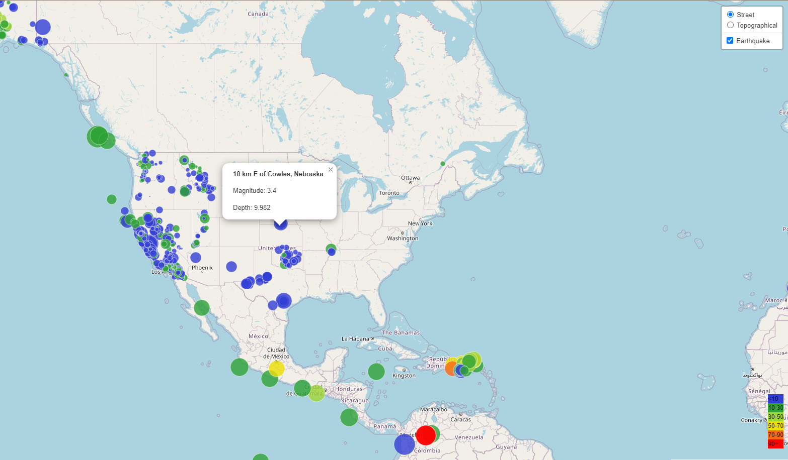
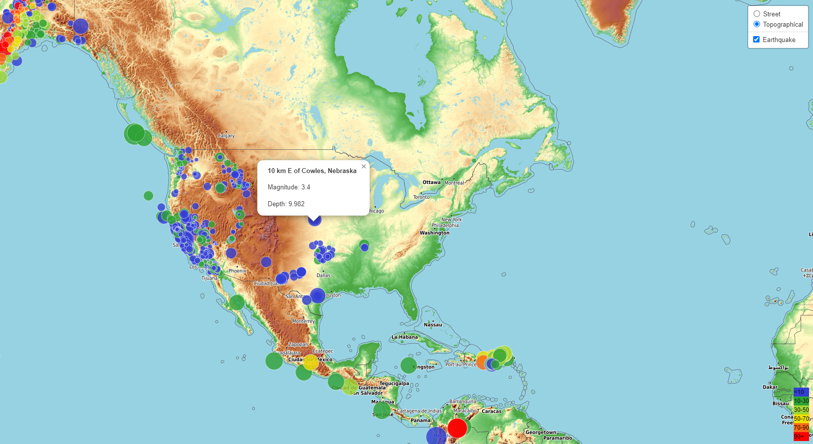

# Leaflet-Challenge
This repository is for the Data Analytics Bootcamp Module 15 Challenge

For this assignment, I built an interactive map to display earthquake data over the course of the past week (provided by the United States Geological Survey (USGS)). They collect a massive amount of data from all over the world each day, so this map was created in an effort to develop a way to visualize USGS data that will allow them to better educate the public and other government organizations (and hopefully secure more funding) on issues facing our planet.

## Images of the interactive map: 

I referenced class activities and instruction provided by Instructor Brett Barnes and TA Ally Qi to complete this activity, as well as data provided by the USGS (https://earthquake.usgs.gov/earthquakes/feed/v1.0/geojson.php).
